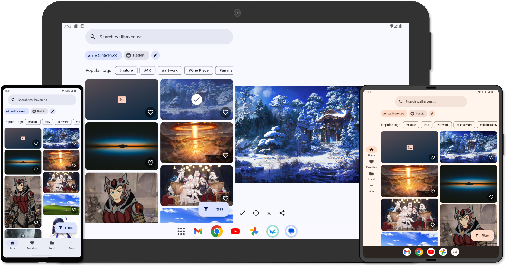

<div align="center">
  
  <h1>WallFlow</h1>
  <div align="center">
    <a href="https://github.com/ammargitham/WallFlow/releases/latest">
      
    </a>
    <a href="https://f-droid.org/packages/com.ammar.wallflow/">
      
    </a>
    <a href="https://github.com/ammargitham/WallFlow/actions/workflows/codeql.yml">
      
    </a>
  </div>
  <br/>
  <p>
  A wallpaper app for Android with beautiful wallpapers from <a href="https://wallhaven.cc/">wallhaven.cc</a> (more sources to be added in the future). Designed with <a href="https://m3.material.io/">Material Design 3</a> and supports wide screen devices like tablets.
  </p>
</div>
<br/>
<div align="center">
  
</div>

## Downloads

[](https://github.com/ammargitham/WallFlow/releases/latest)

|                                                                                                           Regular                                                                                                           |    Plus     |
|:---------------------------------------------------------------------------------------------------------------------------------------------------------------------------------------------------------------------------:|:-----------:|
|                     [](https://f-droid.org/packages/com.ammar.wallflow/)                      | Coming Soon |
| [](https://apt.izzysoft.de/fdroid/index/apk/com.ammar.wallflow/) | Coming Soon |

\*[_What's the difference between Regular and Plus?_](#note)

## Screenshots

<div align="center">

|  |  |  |  |
|:-----------------------------------------------------------------------------------------------------------:|:-------------------------------------------------------------------------------------------------------------------:|:---------------------------------------------------------------------------------------------------------------------:|:---------------------------------------------------------------------------------------------------------------------:|
|                                                 <b>Home</b>                                                 |                                                   <b>Filters</b>                                                    |                                                 <b>Wallpaper Info</b>                                                 |                                                 <b>Search History</b>                                                 |

|  |  |
|:-----------------------------------------------------------------------------------------------------------------------------:|:-----------------------------------------------------------------------------------------------------------------:|
|                                                 <b>Crop and Set Wallpaper</b>                                                 |                                                  <b>Settings</b>                                                  |

</div>

## Features

- Multi-pane layout for tablets and other wide screen devices
- Auto wallpaper changer
- Save searches
- Favorite wallpapers
- Local Wallpapers
- Use saved searches, favorites, and local wallpapers for auto wallpaper changer
- Search history
- Supports all filters provided by wallhaven.cc
- [Optional] Smart wallpaper cropping using on-device object detection powered by [Tensorflow Lite](https://www.tensorflow.org/lite/). ([See note below](#note))
  - Supports adding your own TFLite models. You can find more models [here](https://tfhub.dev/s?deployment-format=lite&module-type=image-object-detection/).
- Search results caching to reduce api calls
- Options to tweak the wallpaper grid layout
- Dynamic theme (Material You)
- Supports multi-display environments (eg. when connected to external monitors)

### Note

Two versions are provided (both free and open-source)

- Regular version without the Object detection feature (smaller apk size).
- Plus version with the Object detection feature. (Since Tensorflow adds around 8MB native libs to the apk size).

**All other features are same in both versions.**

### Details to change wallpaper via broadcast (using Tasker or similar apps)
- Package:
  - For Base: `com.ammar.wallflow`
  - For Plus: `com.ammar.wallflow.plus`
- Action: `com.ammar.wallflow.ACTION_CHANGE_WALLPAPER`

ADB command:
- For Base: `am broadcast --user 0 -a com.ammar.wallflow.ACTION_CHANGE_WALLPAPER com.ammar.wallflow`
- For Plus: `am broadcast --user 0 -a com.ammar.wallflow.ACTION_CHANGE_WALLPAPER com.ammar.wallflow.plus`

## Roadmap

- [ ] Add more sources
- [ ] Support foldables inner and outer screens together
- [ ] More theme colors
- [ ] Learn from favorites (on-device) and suggest wallpapers
- [ ] Support Windows using [Kotlin multiplatform](https://kotlinlang.org/docs/multiplatform.html).

## Built using

- [Jetpack Compose](https://developer.android.com/jetpack/compose/)
- [Material Design 3 components for Compose](https://developer.android.com/jetpack/compose/designsystems/material3)
- [Compose Destinations](https://composedestinations.rafaelcosta.xyz/)
- [Hilt](https://developer.android.com/training/dependency-injection/hilt-android/)
- [Room](https://developer.android.com/training/data-storage/room/)
- [Datastore](https://developer.android.com/topic/libraries/architecture/datastore/)
- [Retrofit](https://square.github.io/retrofit/)
- [Coil](https://coil-kt.github.io/coil/)
- [Telephoto](https://github.com/saket/telephoto/)
- [Paging 3](https://developer.android.com/topic/libraries/architecture/paging/v3-overview/)
- [Accompanist](https://google.github.io/accompanist/)
- [WorkManager](https://developer.android.com/topic/libraries/architecture/workmanager/)
- [My fork](https://github.com/ammargitham/easycrop/) of [EasyCrop](https://github.com/mr0xf00/easycrop/)
- [Tensorflow Lite](https://www.tensorflow.org/lite/)
- [Cloudy](https://github.com/skydoves/Cloudy/)
- [partial-kt](https://github.com/MateriiApps/partial-kt/)
- [Ktlint](https://pinterest.github.io/ktlint/) using [Spotless](https://github.com/diffplug/spotless) plugin
- [Mockk](https://mockk.io/)
- Some more AndroidX libraries. Please see the [build.gradle](./app/build.gradle.kts) file.

## License

```
WallFlow
Copyright (C) 2023  Ammar Githam

This program is free software: you can redistribute it and/or modify
it under the terms of the GNU General Public License as published by
the Free Software Foundation, either version 3 of the License, or
(at your option) any later version.

This program is distributed in the hope that it will be useful,
but WITHOUT ANY WARRANTY; without even the implied warranty of
MERCHANTABILITY or FITNESS FOR A PARTICULAR PURPOSE.  See the
GNU General Public License for more details.

You should have received a copy of the GNU General Public License
along with this program.  If not, see <https://www.gnu.org/licenses/>.
```
